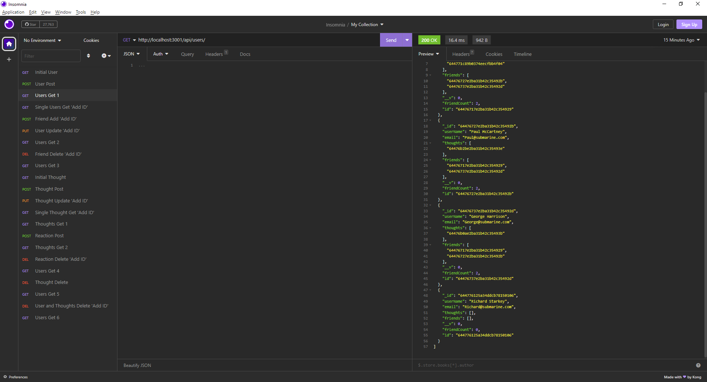

# Homework-Week-18
## MongoDB-Social-Network

My assignment was to build an API for a social network web application where users can share their thoughts, react to friends’ thoughts, and create a friend list.

### User Story
```
AS A social media startup
I WANT an API for my social network that uses a NoSQL database
SO THAT my website can handle large amounts of unstructured data
```

### Table of Contents
1. [Acceptance Criteria](#acceptance-criteria)
2. [Work Description](#work-description)
3. [Screenshot](#screenshot)
4. [Installation](#installation)
5. [Usage](#usage)
6. [License](#license)
7. [Questions](#questions)

### Acceptance Criteria
```
GIVEN a social network API
WHEN I enter the command to invoke the application
THEN my server is started and the Mongoose models are synced to the MongoDB database
WHEN I open API GET routes in Insomnia for users and thoughts
THEN the data for each of these routes is displayed in a formatted JSON
WHEN I test API POST, PUT, and DELETE routes in Insomnia
THEN I am able to successfully create, update, and delete users and thoughts in my database
WHEN I test API POST and DELETE routes in Insomnia
THEN I am able to successfully create and delete reactions to thoughts and add and remove friends to a user’s friend list
```

---
[](https://opensource.org/licenses/MIT)

### Work Description
I first started by creating the models and routes that were outlined in the project README, from there I looked at how they talked to each other and created the necessary paths to connect models to routes. From there I created th controllers to actually run the functions of the methods described inside the routes files. from there I added Mongoose functionality with the index.js file and the connection file. Once I had the controllers built I started testing and debugging my routes and methods. I had trouble with deleting the thoughts along with the user but after reading through the documentation and online resources I was able to get the bonus requirement functioning. I also had an issue with the User and Thought .put methods which ended up been a simple syntax error and I was able to remedy the problem easier. After a final test all routes work as intended and with no errors.

### Screenshot



### Installation
To install the required packages express, mongoose and nodemon use 'npm i' in console to install.

### Usage
Input 'nodemon' into terminal to run local server


### License

The license I am using for my project is<br>[MIT](https://opensource.org/licenses/MIT)

### Questions

GitHub: [Lucienpep](https://github.com/Lucienpep)<br>

For any further questions contact me via:

Email: <xxyyzzoozz@gmail.com>

---
Lucien Haines UADL 2023